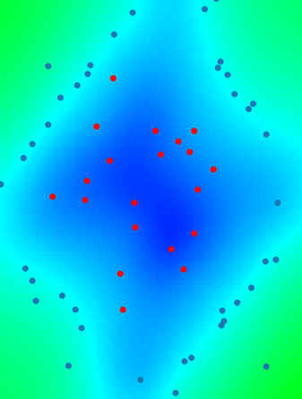

.. ot-smt documentation master file, created by
   sphinx-quickstart on Mon Feb 14 09:17:40 2022.
   You can adapt this file completely to your liking, but it should at least
   contain the root `toctree` directive.

ot-smt documentation
====================

	 
otsmt is a module of OpenTURNS implementing some methods to bind surrogate models from smt into OpenTURNS PythonFunctions.
Available surrogate models from SMT: 
- Least Squares Model
- Neural Network Model
- Radial Basis Function
- Inverse Distance Weighting
- Regularized minimal-energy tensor-product splines
- Second-order polynomial approximation
- Kriging
- Kriging Partial Least Squares (KPLS)
- KPLSK
- Gradient Enhanced KPLS
- Mixtures of Experts

Available multifidelity surrogate models from SMT:
- Multi-Fidelity Kriging 
- Multi-Fidelity KPLS   
- Multi-Fidelity KPLSK  

Available mixed-variables surrogate models from SMT: 
- Mixed Integer Kriging with Continuous Relaxation
- Mixed Integer Kriging with Gower Distance

User documentation
------------------

.. toctree::
   :maxdepth: 1  
   
   user_manual/user_manual

Examples 
--------

.. toctree::
   :maxdepth: 2  
   
   examples/examples

References
----------
- Bouhlel, M. A., Hwang, J. T., Bartoli, N., Lafage, R., Morlier, J., & Martins, J. R. (2019). A Python surrogate modeling framework with derivatives. Advances in Engineering Software, 135, 102662.

Indices and tables
==================

* :ref:`genindex`
* :ref:`modindex`
* :ref:`search`
